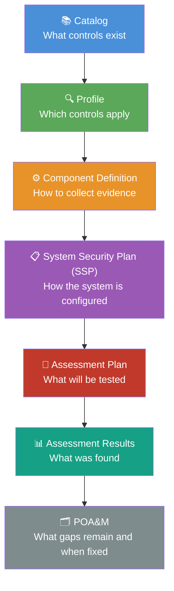
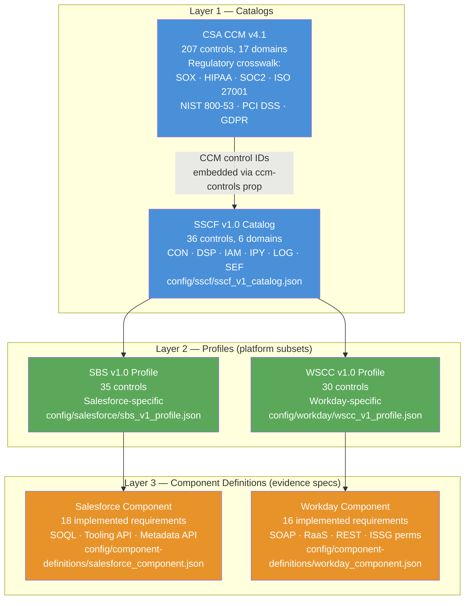
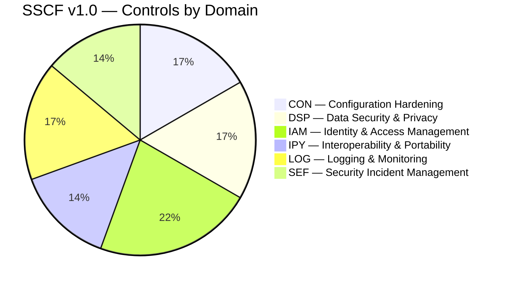
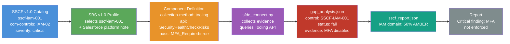
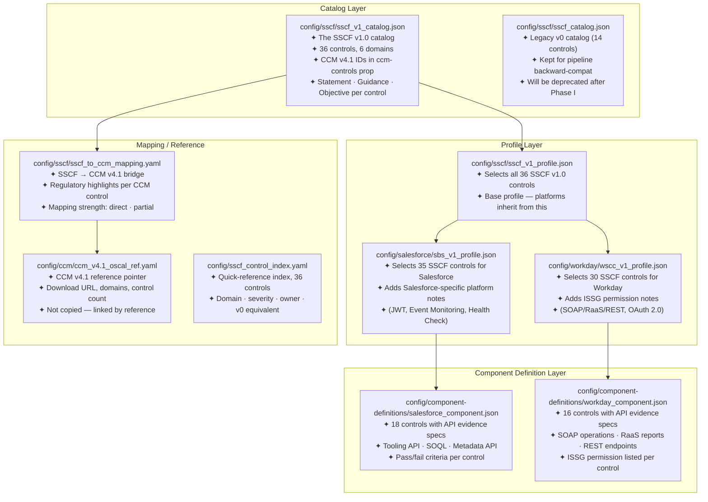
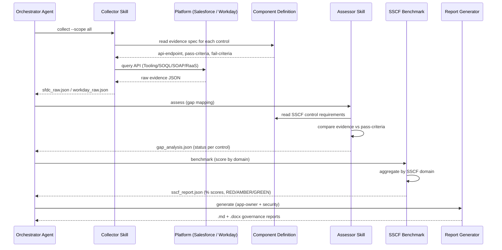
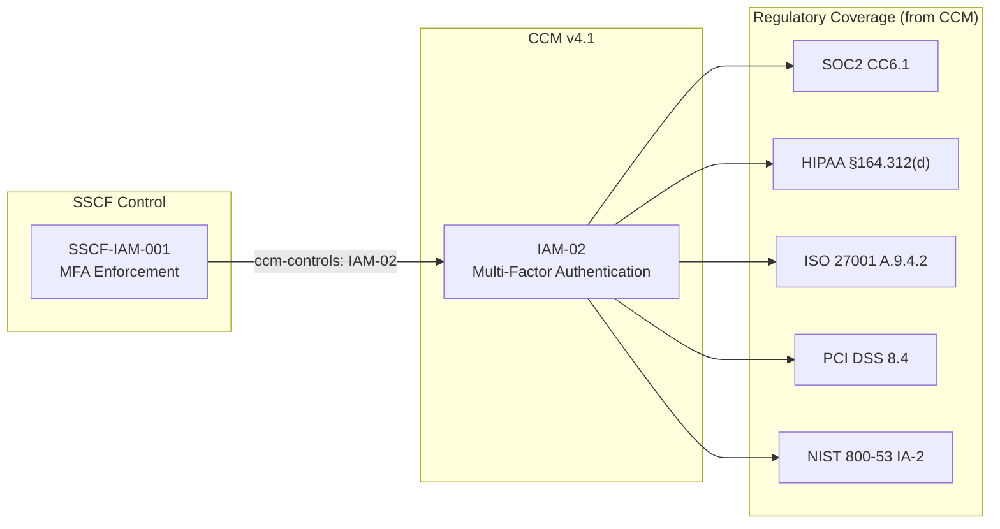
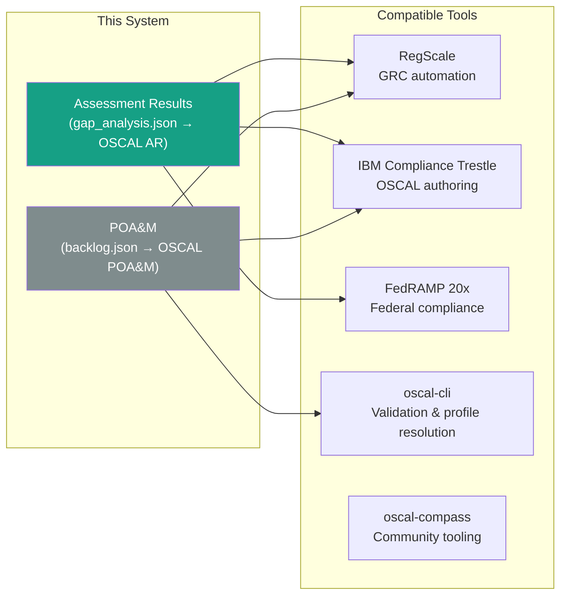

# OSCAL Guide — What It Is and How We Use It

> **New to OSCAL?** Start here. This guide explains the standard from scratch, then walks through exactly how this system uses it — every file, every layer, every decision.

---

## What Is OSCAL?

OSCAL stands for **Open Security Controls Assessment Language**. It is an open standard published by NIST that gives security teams a common machine-readable language to describe:

- What security controls exist (catalog)
- Which controls apply to a given system (profile)
- How a system implements those controls (component definition)
- What evidence was collected during an assessment (assessment results)
- What gaps remain and when they will be fixed (POA&M)

Before OSCAL, every tool, auditor, and GRC platform used its own proprietary format. A Salesforce security report from one vendor looked nothing like one from another. OSCAL solves that by giving everyone the same schema — think of it like JSON for compliance.

**Why this matters to you:** When your OSCAL output files are valid, tools like RegScale, IBM Trestle, and the FedRAMP 20x automation platform can read them directly — no re-entry, no translation, no manual export.

---

## The OSCAL Stack — 7 Layers

OSCAL is not a single document. It is a stack of seven interconnected models. Each layer builds on the one below it.



| Layer | Model | Answers the question |
|---|---|---|
| 1 | **Catalog** | What security controls exist and what do they require? |
| 2 | **Profile** | Which subset of those controls applies to my platform? |
| 3 | **Component Definition** | How do I collect evidence for each control? |
| 4 | **System Security Plan** | How is the system configured to meet each control? |
| 5 | **Assessment Plan** | What will I test, when, and how? |
| 6 | **Assessment Results** | What did I find? Pass, fail, or partial? |
| 7 | **POA&M** | What gaps exist, who owns them, and when will they be fixed? |

> **We currently implement layers 1–3 and 6–7.** Layers 4–5 (SSP and Assessment Plan) are on the roadmap.

---

## Why We Use OSCAL

### Problem Without OSCAL

Before this system, a Salesforce security assessment looked like this:

```
Spreadsheet → Manual review → Word document → Email to stakeholder
```

No machine-readable output. No regulatory crosswalk. Nothing a GRC tool could import. Every assessment was one-off work.

### With OSCAL

```
OSCAL Catalog → OSCAL Profile → Evidence Collection → OSCAL Assessment Results → OSCAL POA&M
```

The output is a structured file any compliant tool can read. The CCM v4.1 regulatory crosswalk (SOX, HIPAA, SOC2, ISO 27001, NIST 800-53, PCI DSS, GDPR) comes for free because it lives in the catalog layer and flows down automatically.

---

## Our OSCAL Architecture

Here is how the three frameworks we assess against relate to each other, and how they map to the OSCAL stack:



### Why This Hierarchy?

**CCM is the foundation.** The Cloud Security Alliance CCM v4.1 is the authoritative cloud security control framework, with 207 controls and a built-in regulatory crosswalk. Rather than rebuilding that crosswalk ourselves, we embed CCM control IDs in our catalog and let the CCM carry the regulatory weight.

**SSCF is our working layer.** The SaaS Security Customer Framework is a 36-control subset of CCM focused on what a SaaS *customer* can configure and assess — not what the vendor controls. SSCF is our catalog.

**SBS and WSCC are the platform lenses.** The Security Benchmark for Salesforce (SBS) and Workday Security Control Catalog (WSCC) are OSCAL profiles that select the SSCF controls relevant to each platform and add platform-specific evidence collection notes.

**Component Definitions are the automation engine.** They specify exactly which API to call, which field to check, and what the pass/fail condition is for every control. This is what makes the collector generic — it reads the component definition rather than having logic hardcoded in Python.

---

## The SSCF v1.0 Control Domains

SSCF v1.0 has 36 controls across 6 domains. Domain codes match CCM v4.1 for interoperability.



| Domain | Code | Controls | What it covers |
|---|---|---|---|
| Configuration Hardening | CON | 6 | Baselines, drift detection, credential lifecycle, hardening, patching |
| Data Security & Privacy | DSP | 6 | Sensitive data access, export controls, classification, retention, privacy rights |
| Identity & Access Management | IAM | 8 | MFA, privileged access, SSO, user lifecycle, service accounts, sessions, JIT, guest access |
| Interoperability & Portability | IPY | 5 | Data portability, API security, integration inventory, vendor exit, data residency |
| Logging & Monitoring | LOG | 6 | Telemetry, admin logging, retention, real-time alerting, SIEM integration, UEBA |
| Security Incident Management | SEF | 5 | Threat enforcement, alert triage, IR plan, forensics, exception governance |

---

## How a Control Flows Through the System

This shows exactly what happens to a single control — `SSCF-IAM-001 (MFA Enforcement)` — from definition to finding:



---

## What Each Config File Does

Here is every OSCAL-related file in this repo and what it is for:



---

## The Assessment Pipeline

This shows how the collector and assessor skills use the OSCAL config files to produce findings:



---

## CCM Regulatory Crosswalk — How It Flows

Because every SSCF control references one or more CCM v4.1 controls via the `ccm-controls` prop, the regulatory mapping comes for free:



**You do not need to maintain the regulatory crosswalk.** When a new regulation maps to CCM controls, and we reference those CCM controls in our SSCF catalog, the regulatory coverage updates automatically.

---

## OSCAL Interoperability

Because this system produces OSCAL-structured outputs, other tools can consume them directly:



> **Note:** Full OSCAL AR and POA&M output is on the roadmap (Phase I). The current `gap_analysis.json` and `backlog.json` follow OSCAL field naming conventions but are not yet fully OSCAL-schema-valid. Phase I migrates them to the official formats.

---

## SSCF v1.0 → OSCAL v0 Control Migration

When we rebuilt from 14 controls (v0) to 36 controls (v1.0), some controls moved domains. Here is the mapping:

| Old ID (v0) | Old Domain | New ID (v1.0) | New Domain | Reason |
|---|---|---|---|---|
| SSCF-CKM-001 | Cryptography (non-standard) | SSCF-CON-003 | Configuration Hardening | Credential lifecycle is a config control per SSCF v1.0 |
| SSCF-TDR-001 | Threat Detection (non-standard) | SSCF-SEF-001 | Security Incident Mgmt | TDR is not a CCM domain; SEF is the correct mapping |
| SSCF-TDR-002 | Threat Detection (non-standard) | SSCF-SEF-002 | Security Incident Mgmt | Same as above |
| SSCF-GOV-001 | Governance (non-standard) | SSCF-SEF-005 | Security Incident Mgmt | Exception governance belongs in SEF per SSCF v1.0 |

The `sscf-v0-equivalent` prop in the v1.0 catalog records these mappings so tools can trace findings across versions.

---

## Common Questions

**Q: Do I need to register anywhere or download anything to use OSCAL?**
No. OSCAL is an open JSON/YAML schema standard. All the OSCAL files in this repo are self-contained. We reference CCM v4.1 control IDs in properties rather than embedding the full CCM catalog, so no download or account is required.

**Q: What does an OSCAL catalog look like in plain English?**
It is a JSON file that says: "Control IAM-001 is called 'MFA Enforcement'. It says: require MFA for all accounts. The guidance is: FIDO2 is preferred, SMS is discouraged for admins. The objective is: verify MFA is enforced, not just offered."

**Q: What is the difference between a catalog and a profile?**
A catalog is a library of all possible controls. A profile is "these are the controls that apply to us" — a curated subset. Think of a catalog as a textbook and a profile as the syllabus for your class.

**Q: What is a component definition?**
It answers "how specifically do I check this control in Salesforce (or Workday)?" For example, the Salesforce component definition for MFA says: call the Tooling API, query `SecurityHealthCheckRisks`, look for the MFA risk row, and check if `EnableMfaDirectUi=true`. That is the pass condition.

**Q: What is the CCM and why does it matter?**
The CSA Cloud Controls Matrix (CCM) v4.1 has 207 controls across 17 cloud security domains. Its main value is a built-in regulatory crosswalk — every CCM control is already mapped to SOX, HIPAA, SOC2, ISO 27001, NIST 800-53, PCI DSS, and GDPR. By referencing CCM control IDs, our SSCF controls inherit those regulatory mappings for free.

**Q: Will findings from this tool be accepted by a FedRAMP auditor?**
After Phase I (OSCAL AR + POA&M), the output files will be OSCAL-schema-valid and compatible with FedRAMP 20x automation tooling. Acceptance by a specific auditor depends on their tooling and process — but OSCAL-valid output is the baseline requirement.

---

## Further Reading

| Resource | Link |
|---|---|
| NIST OSCAL project | https://pages.nist.gov/OSCAL/ |
| OSCAL catalog schema | https://pages.nist.gov/OSCAL/reference/latest/catalog/ |
| CSA CCM v4.1 | https://cloudsecurityalliance.org/artifacts/cloud-controls-matrix-v4-1 |
| awesome-oscal community list | https://github.com/oscal-club/awesome-oscal |
| IBM Compliance Trestle | https://github.com/oscal-compass/compliance-trestle |
| CivicActions OSCAL components | https://github.com/CivicActions/oscal-component-definitions |
